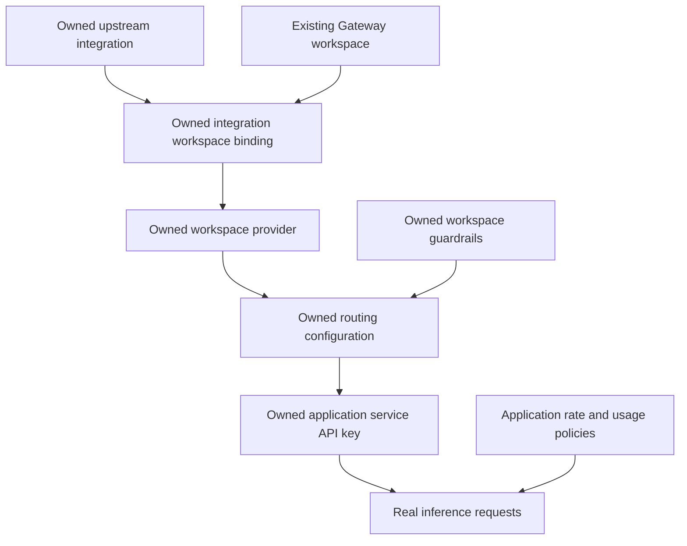

# AI Gateway platform reference scope

Status: implemented for independent review on 2026-10-03. This document records the feature requirements and implementation choices; [run evidence](../live-runs/ai-gateway-expanded.md) establishes the tested behaviors.

## Intended outcome

A newcomer configures a governed AI application in an existing Gateway workspace, sends a real model request, and observes a controlled guardrail denial. The same Terraform project offers optional platform capabilities and runnable routing lessons.

The user selected a full platform reference covering all 15 Gateway resource types in the published provider 0.9.0. External prerequisites remain explicit. The working default application owns its integrations, workspace bindings, providers, routing configurations, guardrails, application credential, and application-scoped request/usage policies.

## Resource coverage

Resource names below carry the `prisma-airs_` prefix.

| Resource | Lesson | Placement |
| --- | --- | --- |
| `gateway_integration` | Connect an upstream model service | Default application |
| `gateway_integration_workspace_binding` | Authorize this workspace to use the integration | Default application |
| `gateway_provider` | Make the connection available to workspace requests | Default application |
| `gateway_config` | Save application routing and attach guardrail hooks | Default application and routing lessons |
| `gateway_guardrail` | Inspect requests/responses; demonstrate AIRS inspection and deterministic denial | Default application |
| `gateway_service_api_key` | Give the application a credential and default configuration | Default application |
| `gateway_rate_limit` | Bound request traffic for the application | Default application |
| `gateway_usage_limit` | Bound measured application usage | Default application |
| `gateway_secret_reference` | Reference an existing external secret store | Optional |
| `gateway_user_api_key` | Configure access for an existing user | Optional |
| `gateway_mcp_integration` | Register an external MCP connection | Optional |
| `gateway_mcp_integration_workspace_binding` | Authorize workspace access to that MCP integration | Optional |
| `gateway_mcp_server` | Expose the integration within the workspace | Optional |
| `gateway_deployment` | Register hybrid deployment settings | Optional; installation remains external |
| `gateway_org_guardrail` | Configure an organization-wide inspection baseline | Optional; explicit opt-in |

## Routing and security lessons

Required routing patterns:

- Ordered fallback with retries; the first getting-started path.
- Weighted balancing.
- Conditional routing.
- Caching.

Each claimed behavior needs a real request demonstration. Successfully storing a configuration is insufficient evidence that requests use it.

The default security lesson combines a Prisma AIRS guardrail with a deterministic denial check. AIRS inspection references a Runtime Security profile and depends on the tenant's PANW Prisma AIRS Gateway plugin. The plugin holds the inspection endpoint and authentication; the check itself does not receive an upstream model or scanning key.

Vulture has an active Prisma-labelled plugin with a nonempty inspection credential, discovered through read-only metadata inspection. The live request test confirmed injection detection and blocking. The registered tenant JSON supplies management credentials only; new callable upstream integrations require additional model-service credentials.

Organization guardrails are organization-scoped resources and require explicit opt-in. This example also attaches its optional policy to all four owned routing configurations. The tested deployment enforced that attachment; the unreferenced policy did not deny its marker. Automatic enforcement in other workspaces is not established. The released resource does not expose workspace exclusions.

## Getting-started documentation

All four product READMEs use this reader journey:

1. Explain what the example creates and what the reader can do with it.
2. List product access and external prerequisites.
3. Load management and application credentials through environment variables.
4. Copy the nonsecret input file and replace its placeholders.
5. Initialize Terraform, review a plan, and apply it.
6. Explain outputs and perform the product's supported next action.
7. Show a small configuration change.
8. Clean up and explain any retained archival records.

Normal Terraform commands are the main path. The AIRS CLI tenant helper is an optional convenience and does not require every reader to use the vulture tenant.

Short, clearly labeled sanitized live outputs stay close to the apply instructions. Detailed lifecycle transcripts, test boundaries, receipts, and cleanup checks move to supporting documentation. A guide must distinguish creating configuration from executing inference, assessments, or scans.

## Implementation choices

- Connections support one upstream with two models or two independent services. Live prerequisites come from the owner-provided local credential file, kept outside this repository.
- The Gateway root owns a dedicated Runtime Security profile.
- Record management lifecycles separately from request behavior. External-secret retrieval requires a real secret-manager fixture and is not implied by reference creation.
- Optional secret managers use typed supported names. MCP defaults to the public Microsoft Learn server; identities and connected infrastructure remain external.
- Simple cache with bounded lifetime; conditional routing on metadata.tier; weighted routing uses a configurable primary weight.
- Application requests use an owned service key, its default config, x-portkey-api-key, and explicit application metadata. Runtime helpers take deployment endpoints from the environment. Metadata is caller-supplied; the policies demonstrate matching rather than authenticated application identity.
- The live fixture used two separate connections to one backend/model. This proves routing selection and controlled connection failover, not resilience across independent services.

The existing vulture full-lifecycle cleanup requirement and public evidence sanitization continue to apply. Supply Chain additions remain separately gated on their provider release.

## Sources

- [Gateway routing configurations](https://docs.paloaltonetworks.com/prisma-airs/ai-gateway/ai-gateway-configs)
- [Gateway administration and plugin configuration](https://docs.paloaltonetworks.com/prisma-airs/ai-gateway/ai-gateway-admin-settings)
- [SaaS Gateway setup](https://docs.paloaltonetworks.com/prisma-airs/ai-gateway/configure-ai-gateway-saas)
- [Runtime API guardrail configuration](https://docs.paloaltonetworks.com/prisma-airs/ai-gateway/ai-gateway-guardrails/configure-ai-runtime-api-guardrail)
- Published Prisma AIRS Terraform provider 0.9.0 documentation and implementation.
