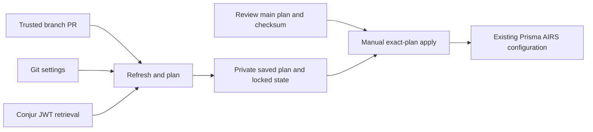

# Adopt a Prisma AIRS tenant into Forgejo CI/CD

Use this CI/CD harness around a Terraform root that owns existing Prisma AIRS
configuration. Settings are reviewed in Git, credentials come from Conjur inside
the job, and one versioned MinIO state coordinates every writer. The Vulture
reference deployment adopts **357 resources across all four products**. This
public folder contains the reusable harness; private tenant declarations, inputs,
state, and plan files are intentionally excluded.

Start with the [Runtime Security](../../ai-runtime-security/README.md),
[Red Teaming](../../ai-red-teaming/README.md), [Gateway](../../ai-gateway/README.md),
and [Supply Chain](../../ai-supply-chain-security/README.md) guides for product
configuration concepts. For an existing environment, retain observed values and
import its objects before enabling changes.



## Prerequisites

- Terraform 1.16.4 and provider 0.12.0; Python 3 with `venv`; Git and Node 24 in
  the job image. Terraform downloads are checked against a pinned archive digest.
- A **private Forgejo repository** whose collaborators are trusted with tenant
  credential authority. The public example repository never receives that trust.
- A dedicated repository-scoped Forgejo runner, a Conjur JWT authenticator, and
  a dedicated Kubernetes service account with audience `conjur`.
- A private MinIO bucket with versioning, conditional writes, and scoped S3
  credentials. Its endpoint must be reachable from the runner's job container.
- Existing tenant configuration, management credentials, required product
  entitlements, and one authoritative Terraform state or a fresh import project.

The workflow's fork guard is routing, not a separate security boundary. Do not
add untrusted/read-only collaborators to the privileged private repository or
approve their fork workflows. Repository ACLs grant credential authority; any
trusted collaborator can edit executable Terraform and workflow code.

## 1. Prepare the private project and import

Copy this folder to the root of your private repository, including its hidden
`.forgejo` directory. Add your resource declarations and variables beside
`versions.tf`. `main.tf` is a placeholder: the harness refuses an empty state and
does not create demonstration objects automatically.

If an existing root already owns the tenant, use that root and state. **Do not
import those objects into another active state.** Otherwise, start a protected
local project, configure management environment authentication through Conjur,
write resource blocks matching the observable existing settings, and import.
These representative addresses cover all four products:

```bash
terraform import prisma-airs_runtime_custom_topic.existing '<topic-id>'
terraform import prisma-airs_red_team_custom_prompt_set.existing '<uuid>'
terraform import prisma-airs_gateway_config.existing '<uuid>'
terraform import prisma-airs_supply_chain_security_group.existing '<uuid>'
terraform plan -detailed-exitcode
```

The IDs above are **placeholders for objects you discover in your own tenant**,
not recorded output. Read each resource's import section in the
[provider documentation](https://cdot65.github.io/terraform-provider-prisma-airs/).
For bulk adoption, Terraform import blocks and `plan -generate-config-out` can
help recover declarations; review generated configuration before applying an
import plan. Stop if it also proposes remote changes. Include `prevent_destroy`
on every imported resource. Preserve unavailable secrets as omitted, rather than
inventing credentials or committing masked values.

During this one-time local adoption, leave `backend.tf` outside the root (for
example, rename it to `backend.tf.disabled`). Add it when migrating the verified
state in step 4. Once CI owns the root, use reviewed pipeline applies.

## 2. Put settings in Git and credentials in Conjur

Set `ci/settings.json` for your repository, tenant TSG, Conjur account/service,
MinIO endpoint, bucket, and state key. `backend.tf` must use the **same bucket,
key, and region**. Set `minimum_managed_resources` to your imported baseline.

`config/desired.json` contains an object keyed by Terraform variable name. For
example, a variable named `upstream_api_keys` would have a corresponding
`upstream_api_keys` object. The pipeline sends every root value through
`TF_VAR_<name>`. Ordinary nonsecret settings remain in Git; a secret leaf is null:

```json
{
  "upstream_api_keys": {
    "open-ai": null,
    "anthropic": null
  }
}
```

Declare only secret leaves in `config/secret-bindings.json`:

```json
[
  {"path": ["upstream_api_keys", "open-ai"], "variable": "data/prisma-airs-terraform/my-tenant/upstreams/open-ai"},
  {"path": ["upstream_api_keys", "anthropic"], "variable": "data/prisma-airs-terraform/my-tenant/upstreams/anthropic"}
]
```

These are **configuration templates**, not fabricated live output. The
[Gateway provider catalog example](../../ai-gateway/provider-catalog/README.md)
resolves OpenAI and Anthropic provider-family UUIDs through a data source; only
upstream credentials belong in these bindings.

Adapt `conjur-policy.yml.example`, add declarations/grants for each input secret,
and load it through your Conjur administrator. Seed these five standard variables
under the configured prefix, plus every input binding:

| Conjur suffix | Terraform environment |
| --- | --- |
| `management/client-id` | `PANW_MGMT_CLIENT_ID` |
| `management/client-secret` | `PANW_MGMT_CLIENT_SECRET` |
| `management/tsg-id` | `PANW_MGMT_TSG_ID` |
| `backend/access-key-id` | `AWS_ACCESS_KEY_ID` |
| `backend/secret-access-key` | `AWS_SECRET_ACCESS_KEY` |

The JWT authenticator must verify your Kubernetes issuer/JWKS, audience `conjur`,
and map `sub` to the host identity beneath `apps` (`token-app-property=sub`,
`identity-path=apps`). Keep its signing keys current after cluster key rotation.
See [Conjur's Kubernetes JWT integration](https://docs.cyberark.com/conjur-open-source/latest/en/content/integrations/jwt/jwt-auth.htm).

The wrapper preserves omitted fields, nulls, empty strings, list order, and native
JSON types. It rejects missing/non-null binding leaves, duplicate paths, empty
credentials, and a TSG mismatch. Credentials remain in process memory/environment;
they are not exported as workflow outputs or Git files. **State and binary plans
still contain sensitive values.**

## 3. Provision the runner

The [infrastructure](infrastructure/10-runner.yaml) illustrates the dedicated
runner: service-account automount disabled, projected JWT/CA at `/conjur`, inbound
pod traffic denied, and one Docker job at a time. Replace the namespace, image,
Forgejo connection, node selector, storage class, and Conjur identity consistently.

Build [job-image.Dockerfile](infrastructure/job-image.Dockerfile) and publish it to
your registry. Update both the runner label and workflow container image. Configure
an ordinary shared runner's `node` label for offline checks without `/conjur`.

Register the privileged runner **at the private repository scope**, using Forgejo's
repository settings or its runner API. Store its `server.connections` URL/UUID/token
YAML in the out-of-band `runner-connection` Secret. Supply a `conjur-ca` ConfigMap
with the server CA under `ca.pem`. The init container assembles its restricted
configuration as the same UID/GID 1000 used by the runner.

The Conjur authenticator bootstrap uses an administrator. Jobs authenticate with
their projected workload JWT, never an administrator API key. Prove that the
workload can read its variables and cannot execute a permission check for an
unrelated variable before enabling the tenant workflow.

## 4. Migrate and verify one state

Enable bucket versioning. Grant `ListBucket`/`GetBucketLocation`, `GetObject` and
`PutObject` on the exact state key, and `GetObject`/`PutObject`/`DeleteObject` on its
`.tflock`. Grant private plan access under `plans/`. The pipeline must not have
state-object deletion or unrelated-bucket access. Operator version recovery needs
a separate administrative identity.

The [HashiCorp S3 backend guide](https://developer.hashicorp.com/terraform/language/backend/s3)
documents lockfiles and environment authentication. This MinIO example uses
`AWS_ENDPOINT_URL_S3` and the compatibility flags in `backend.tf`.

Before moving tenant state, prove duplicate conditional writes fail and two
Terraform operations contend for the same lock, using a disposable **local-only**
`terraform_data` project at a separate backend key. Confirm lock cleanup and
versioning. Never test locking with tenant mutations.

Back up the exact current state and inputs in a protected directory. Add the
configured `backend.tf`, retrieve scoped backend credentials from Conjur into the
operator process, then run:

```bash
terraform init -migrate-state -lockfile=readonly
terraform state pull > protected-remote-state.json
terraform plan -detailed-exitcode
```

Compare every resource address/identity, lineage, and serial with the backup.
During the Vulture run, migration assigned a new lineage/serial; after verifying
identical identities and an untouched new backend, an operator restored the
verified original lineage using `state push -force`. That is a recovery operation,
not a routine migration command. The serial advanced monotonically by one.

Require exit **0** with no changes. Investigate exit **2** before proceeding; never
apply it just to make adoption look clean. Retire the local active state after
confirming remote ownership, retaining protected backups. Do not embed S3 credentials
in HCL or backend arguments; they can be persisted in plan/backend metadata.

## 5. Review and apply from Forgejo

The supplied workflow runs offline validation first. Trusted branch PRs get live
plans. Main pushes or manual **plan** dispatches create a main plan. Raw binary
plans, diagnostics, and redacted review text stay private at
`plans/<plan-id>/`; only addresses, counts, commit, and checksum appear in logs.

Review the Git diff and private `review.txt`, then use **Actions → Terraform → Run
workflow** on **main** with `operation=apply`, `plan_id`, and `reviewed_sha256` from
that exact main plan. Keep `noop_only=true` for the first run. Clear it only for
an intentional reviewed update. PR plans cannot be applied.

```bash
aws --endpoint-url "$AWS_ENDPOINT_URL_S3" s3 cp \
  "s3://<your-bucket>/plans/<plan-id>/review.txt" -
```

Apply checks artifact integrity, current main commit, exact resolved inputs and
all five management/backend credentials,
24-hour expiry, state lineage/serial/count, protected deletion/replacement, and a
refresh-only drift check before executing the saved plan. A changed credential,
new state, or stale main commit requires a new review. Workflow concurrency avoids
cancellation; the S3 lock provides state writer coordination.

Run offline checks locally:

```bash
python3 ci/install-terraform.py
.ci-bin/terraform fmt -check -recursive
TF_CLI_CONFIG_FILE="$PWD/ci/registry.tfrc" .ci-bin/terraform init -backend=false -lockfile=readonly
.ci-bin/terraform validate
python3 -m unittest discover -s ci/tests -v
```

Read [live-run.md](live-run.md) for recorded Vulture results, with identifiers
sanitized. The four public product projects retain their own execution guides;
this harness adds shared ownership, Conjur retrieval, and reviewed CI/CD changes.
